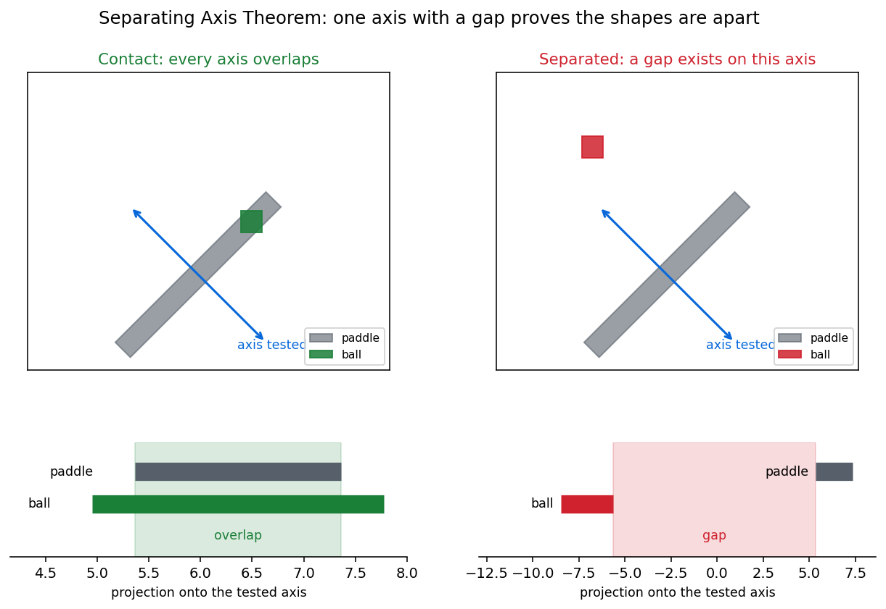

# Motion Controlled Pong

An Android Pong game played by tilting the phone. The accelerometer slides the
paddle, the gyroscope rotates it, and collisions are resolved with the Separating
Axis Theorem so the ball bounces correctly off a paddle held at an angle.



## Requirements

JDK 17, the Android SDK with platform 34, and a device or emulator running
API 24 or later.

## Building and running

```bash
./gradlew assembleDebug
```

Install the resulting APK from `build/outputs/apk/debug/` on a device, or run the
configuration from Android Studio.

```bash
./gradlew test
```

The geometry tests run on a plain JVM and need no device.

## Controls

| sensor | effect |
| --- | --- |
| accelerometer | slides the paddle left and right, clamped to the screen |
| gyroscope | rotates the paddle, clamped to a maximum angle |
| linear acceleration | a flick along Z adds speed to the ball on the next hit |

## Collision detection

A rotated paddle is why this needs the Separating Axis Theorem rather than a
rectangle overlap test. Once the paddle tilts it is no longer axis-aligned, and
comparing bounding boxes either misses glancing hits or reports contact that
never happened.

SAT rests on one fact about convex shapes: if they are apart, some axis exists on
which their shadows do not overlap, and that axis is perpendicular to an edge of
one of them. The test is therefore finite. Project both shapes onto every edge
normal; the first gap found proves separation and ends the search, and if no axis
has a gap the shapes are in contact.

The `geometry` package holds this as plain JVM code with no Android imports, so
it can be tested without a device.

| class | responsibility |
| --- | --- |
| `Vector2` | Immutable 2D vector: subtract, perpendicular, dot product, rotate |
| `Projection` | A shadow on an axis, as a minimum and maximum, and whether two overlap |
| `Polygon` | Vertices, edge normals, projection onto an axis, rotation |
| `SatCollision` | The overlap test itself |

## Physics

`Ball` integrates position and velocity per frame under constant downward
acceleration. Gravity is defined in metres per second squared and converted
through an explicit pixels-per-metre scale, since positions are in pixels;
raising that scale gives a heavier, faster-falling ball.

Sensor listeners are registered in `onAttachedToWindow` and released in
`onDetachedFromWindow`, so nothing keeps sampling once the view leaves the
screen.

## Project structure

```
src/main/java/com/example/mypongv2/
    geometry/          framework-free collision maths
    Ball.java          position, velocity, gravity
    PongGameView.java  rendering, sensor handling, game loop
    ResetButton.java   the on-screen reset control
    MainActivity.kt    entry point
src/main/res/          layouts, drawables, themes
src/test/java/         geometry tests, JVM only
docs/                  figures referenced by this README
build.gradle.kts       module configuration and dependencies
settings.gradle.kts    repositories and project name
```

## Testing

```bash
./gradlew test
```

Twenty-three tests across `Vector2`, `Polygon` and `SatCollision`, covering
vector algebra, rotation, projection, encapsulation of polygon vertices, and
collision in the overlapping, separated, touching, contained and rotated cases.
